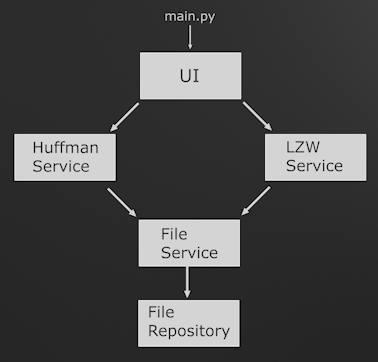

## Project structure

## Time & Space complexities

### Huffman
||Time complexity|Space complexity|
|---|---|---|
|encoding|O(n log n)|O(n)
|decoding|O(n log n)|O(n)

### Lempel-Ziv-Welch
||Time complexity|Space complexity|
|---|---|---|
|encoding|O(n)|O(n)
|decoding|O(n)|O(n)

## Performance

The results are sorted based on file size and the final column is the size of the compressed file compared to the original in percentages.

Tests ran on:
Lenovo ThinkPad T490
Intel(R) Core(TM) i5-8265U

### Huffman
| Name                  |   Compression Time (ms) |   Decompression Time (ms) |   Size (bytes) |   Compressed Size % |
|-----------------------|-------------------------|--------------------------|----------------|---------------------|
| sia_cheap_thrills.txt |                    1.58 |                     2.79 |           2892 |               83.92 |
| grammar.lsp           |                    2.05 |                     3.67 |           3721 |               94.09 |
| xargs.1               |                    2.1  |                     5.02 |           4227 |               91.86 |
| jfk_speech.txt        |                    2.71 |                     6.85 |           7429 |               66.52 |
| fields.c              |                    4.28 |                    11.59 |          11150 |               77.04 |
| asyoulik.txt          |                   38.25 |                   127.81 |         125179 |               61.48 |
| alice29.txt           |                   41.82 |                   139.06 |         152089 |               56.46 |
| lcet10.txt            |                  117.98 |                   426.05 |         426754 |               57.5  |
| plrabn12.txt          |                  129.24 |                   467.87 |         481861 |               55.56 |
| 2mb sample text.txt   |                  579.69 |                  1912.12 |        2167737 |               52.88 |

### LZW
| Name                  |   Compression Time (ms) |   Decompression Time (ms) |   Size (bytes) |   Compressed Size % |
|-----------------------|-------------------------|--------------------------|----------------|---------------------|
| sia_cheap_thrills.txt |                    1.1  |                     0.81 |           2892 |               60.68 |
| grammar.lsp           |                    1.24 |                     0.84 |           3721 |               56.81 |
| xargs.1               |                    1.45 |                     1.04 |           4227 |               63.59 |
| jfk_speech.txt        |                    2.4  |                     1.64 |           7429 |               57.75 |
| fields.c              |                    3.19 |                     1.94 |          11150 |               47.65 |
| asyoulik.txt          |                   38.91 |                    25.69 |         125179 |               57.46 |
| alice29.txt           |                   44.06 |                    28.64 |         152089 |               53.14 |
| lcet10.txt            |                  126.73 |                    80.54 |         426754 |               53.94 |
| plrabn12.txt          |                  143.84 |                    95.15 |         481861 |               55.78 |
| 2mb sample text.txt   |                  655.71 |                   405.68 |        2167737 |               44.29 |

We can see that my implementation of the Huffman compression struggles when the file size is small -- whether this is because I save the code table as a JSON file or because of an inherent property of Huffman, is unclear.

Looking at the data, it's clear that the LZW-algorithm is superior in almost everyway; it manages to compress the files better, even in larger files and the decompression times are significantly shorter. The Huffman, however, beats the LZW slightly when it comes to compression times in larger files.

## What could be improved

Currently the Huffman-tree is stored in a separate JSON file, which is both, unefficient and non-elegant.
A better solution would be to store the tree on the same file as the encoded content.

## Sources
